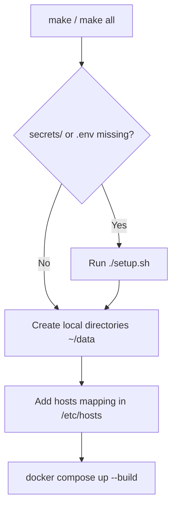

# Developer Documentation

This document describes how to set up, build, manage, and debug the Inception infrastructure.

---

## 1. Environment Setup

### Prerequisites
Before starting, ensure your development machine has the following tools installed:
*   **Operating System:** macOS or a modern Linux distribution.
*   **Docker Desktop** (or Docker Engine with Docker Compose v2).
*   **GNU Make** (`make`).
*   **openssl** (used by the credential script to generate cryptographically secure passwords).

### Configuration Files
The configuration uses a split model:
1.  **`srcs/.env`:** Stores environment parameters that are not sensitive (such as database name, host, and SSL localized variables). If missing, it is created automatically by copying values from `srcs/.env.example`.
2.  **`secrets/`:** A directory located at the root of the project containing raw files with sensitive passwords and WordPress account configs. This folder is listed in `.gitignore` and must never be committed.

### Local Domain Resolution
For NGINX to map the host URL, you need to map `samcasti.42.fr` to the local loopback interface. The build script automatically executes `sudo hostsed add 127.0.0.1 samcasti.42.fr`, adding this entry to your host's `/etc/hosts` file.

---

## 2. Building and Launching the Project

To build and launch the environment from scratch:
1.  Ensure Docker is running on your machine.
2.  In the repository root, run:
    ```bash
    make
    ```
This target triggers the following sequence:


---

## 3. Container & Volume Management Commands

Developers can use standard Docker and Compose CLI tools inside the project.

### Managing Containers
*   **View active processes:**
    ```bash
    docker compose -p inception -f srcs/docker-compose.yml ps
    ```
*   **View real-time stream logs:**
    ```bash
    docker compose -p inception -f srcs/docker-compose.yml logs -f
    ```
*   **Access a container's shell (e.g., WordPress):**
    ```bash
    docker exec -it wordpress sh
    ```

### Managing Volumes & Networks
*   **List active project networks:**
    ```bash
    docker network ls
    ```
*   **Inspect a volume's configuration:**
    ```bash
    docker volume inspect inception_database
    ```

---

## 4. Data Persistence & Storage Locations

To prevent data loss when containers are stopped, database and website files are persisted on the host machine.

### Local Mount Locations
By design, the Docker Compose file uses local bind mounts mapped to the developer's home directory:
*   **Database Files (MariaDB):** Mounted from Host `~/data/database` to Container `/var/lib/mysql`.
*   **Website Files (WordPress):** Mounted from Host `~/data/wordpress_files` to Container `/var/www/inception`.

### Data Persistance Lifetime
*   **Container Recreates:** Running `make down` or `make clean` stops the services but **retains all data**. When the stack is rebuilt, MariaDB and WordPress will load the existing state.
*   **Total Purge:** Running `make fclean` will delete the host storage directory `~/data/` completely, wiping the database and WordPress files.
